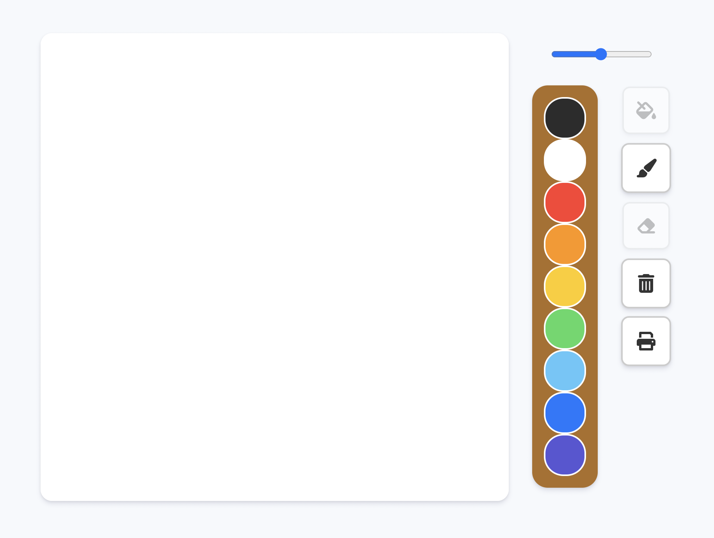

# paintjs

Painting Board made with VanilaJS

This is a toy project using HTML, CSS and JavaScript.

## Table of contents

- [Overview](#overview)
  - [Function](#function)
  - [Screenshot](#screenshot)
  - [Links](#links)
- [My process](#my-process)
  - [Built with](#built-with)
  - [What I learned](#what-i-learned)
- [Author](#author)

## Overview

### Function

- Draw
- Color
- Erase
- Delete
- Save

### Screenshot

### Links

- Live Site URL: [https://thisisyeji.github.io/paintjs/](https://thisisyeji.github.io/paintjs/)

## My process

### Built with

- Semantic HTML5 markup
- CSS
- JavaScript

### What I learned

## Author

- Website - [Yeji Kim](https://github.com/thisisyeji)
